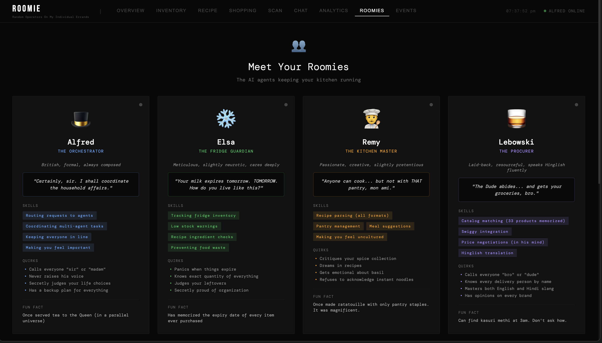
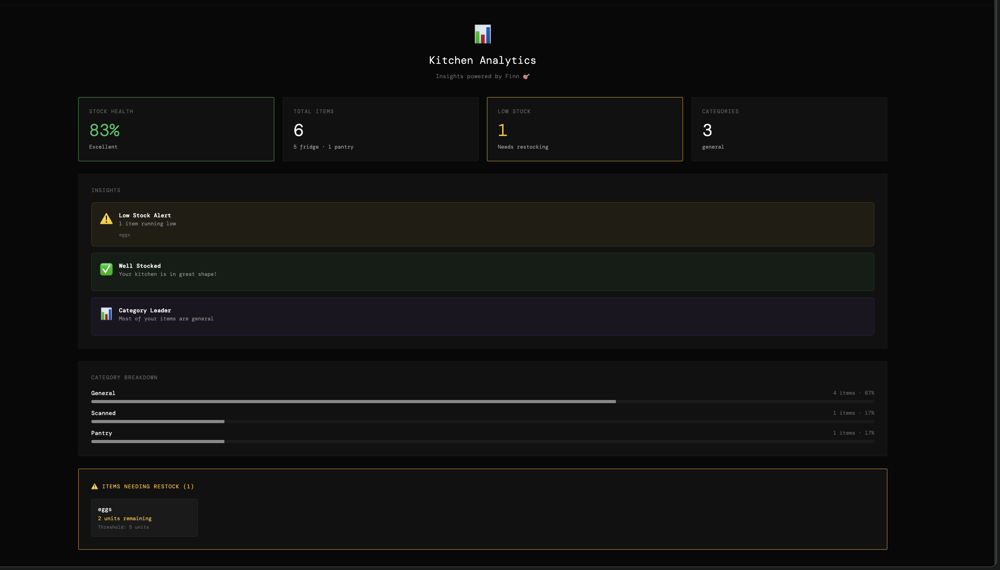
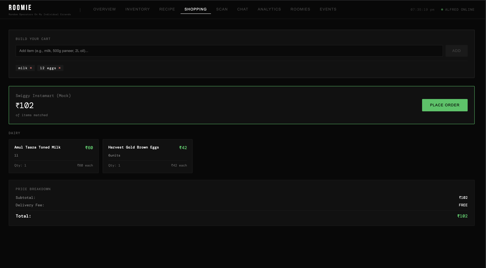
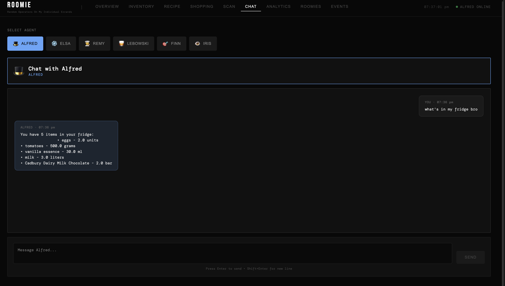
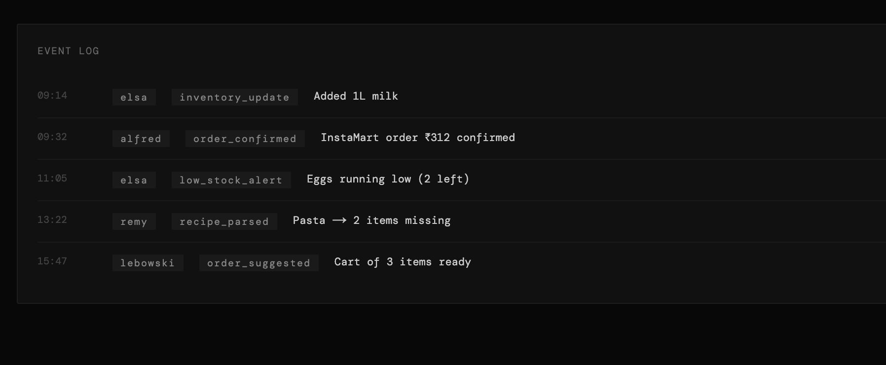
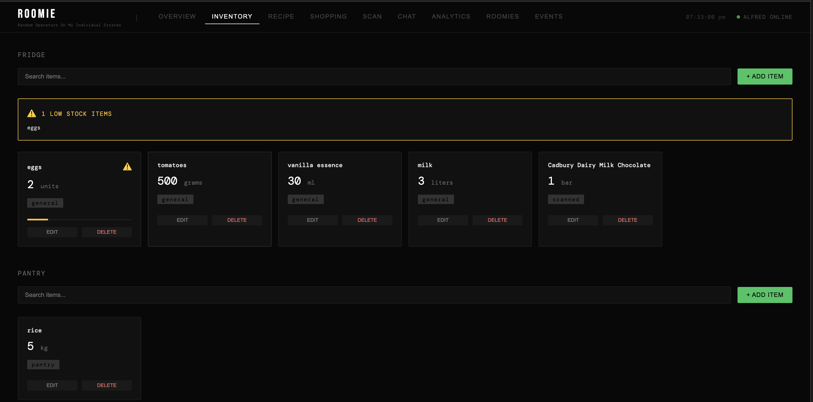

# 🏠 ROOMIE - Smart Home Kitchen Assistant

**Random Operators On My Individual Errands**

A complete multi-agent AI system for intelligent kitchen management, recipe parsing, and automated grocery procurement.

**Version:** Phase 3 Complete  
**Status:** ✅ In Dev
**Last Updated:** April 26, 2026

---

## 🎯 What is ROOMIE?

ROOMIE is your complete smart kitchen assistant featuring:
- **6 AI Agents** working together seamlessly
- **9-Tab Web Dashboard** for full control
- **Telegram Bot Interface** for mobile access
- **Photo Recognition** for instant inventory updates  
- **Real-time Analytics** with AI insights
- **Swiggy Integration** for automated ordering (OAuth 2.0)

---

## ✨ Key Features

### 🗄️ Inventory Management
- Track fridge and pantry items in real-time
- Full CRUD operations (Add, Edit, Delete, View)
- Automatic low stock warnings
- Category-based organization
- Photo scanning with 3 intent modes (Add/Used/General)

### 📖 Recipe Intelligence
- Parse recipes from URLs, text, or dish names
- Check what you have vs what you need
- Identify missing ingredients
- Auto-generate shopping lists

### 🛒 Smart Shopping
- Build shopping carts automatically from recipes
- Match ingredients to Swiggy Instamart catalog
- Real-time price comparison
- Place COD orders with OAuth 2.0
- Mock mode for safe testing

### 📸 Photo Scanner  
- Upload fridge/pantry photos
- AI-powered item detection by Iris
- Three modes: Adding Items / Used Items / General Scan
- Confidence scores on all detections

### 📊 Analytics Dashboard
- Stock Health Score (0-100%)
- Category breakdowns with visual charts
- AI-generated insights by Finn
- Low stock tracking and alerts

### 💬 Agent Chat
- Talk to any of the 6 agents individually
- Natural language commands
- Context-aware responses
- Agent-specific personalities

---

## 🤖 The Six Agents

| Agent | Role | Personality | Emoji |
|-------|------|-------------|-------|
| **Alfred** | Orchestrator | British, formal, coordinates the team | 🎩 |
| **Elsa** | Fridge Manager | Meticulous, panics when things expire | ❄️ |
| **Remy** | Kitchen Master | Passionate chef, judges your choices | 👨‍🍳 |
| **Lebowski** | Procurer | Laid-back, speaks Hinglish | 🥃 |
| **Finn** | Strategist | Data-driven, predicts patterns | 🎯 |
| **Iris** | Observer | Visual expert, processes photos | 👁️ |

---

## 🚀 Quick Start

### Prerequisites
- Python 3.11+
- Node.js 18+
- LLM API key (Claude, OpenAI, or Ollama)

### Installation

```bash
# 1. Extract/clone project
cd ~/Desktop/meh/roomie

# 2. Configure environment
cp .env.example .env
# Edit .env and add ANTHROPIC_API_KEY or OPENAI_API_KEY

# 3. Install Python dependencies
pip install -r requirements.txt --break-system-packages

# 4. Start backend
bash scripts/start_dev.sh

# 5. Install frontend (new terminal)
cd roomie-web
npm install

# 6. Start frontend
npm run dev

# 7. Open http://localhost:3001
```

---

## 📱 Web Dashboard (9 Tabs)

1. **OVERVIEW** - System status, clickable cards
2. **INVENTORY** - Full CRUD for fridge & pantry
3. **RECIPE** - Parse recipes (URL/text/dish)
4. **SHOPPING** - Build carts, place orders
5. **SCAN** - Photo upload with intent selection
6. **CHAT** - Talk to any agent
7. **ANALYTICS** - Insights, metrics, charts
8. **ROOMIES** - Agent personalities
9. **EVENTS** - Activity log

---

## 📁 Project Structure

```
roomie/
├── agent_skills/        # AI Agents
│   ├── alfred/         # Orchestrator + API
│   ├── elsa/           # Fridge manager
│   ├── remy/           # Pantry + recipes
│   ├── lebowski/       # Procurement
│   ├── finn/           # Analytics
│   └── iris/           # Image recognition
├── shared/             # Shared code
│   ├── db.py          # Database models
│   ├── llm_provider.py # LLM abstraction
│   └── swiggy_mcp.py  # OAuth client
├── roomie-web/        # Next.js frontend
│   ├── app/           # Pages
│   ├── components/    # 12 React components
│   └── lib/           # API client
├── interfaces/        # External interfaces
│   └── telegram/      # Telegram bot
├── scripts/           # Utilities
└── data/              # SQLite database
```

---

## 🔌 API Endpoints

- `GET /health` - Health check
- `GET /status` - System status
- `POST /message` - Send message to agents
- `GET /inventory/fridge` - List fridge items
- `GET /inventory/pantry` - List pantry items
- `POST /inventory/{fridge|pantry}` - Add item
- `PUT /inventory/{fridge|pantry}/{id}` - Update item
- `DELETE /inventory/{fridge|pantry}/{id}` - Delete item

See `API_DOCUMENTATION.md` for full reference.

---

## ⚙️ Environment Variables

```env
# LLM Provider (Required)
ANTHROPIC_API_KEY=your_key_here
# OR
OPENAI_API_KEY=your_key_here

# Swiggy MCP (Optional)
SWIGGY_MCP_ENABLED=false  # true for real orders
SWIGGY_MCP_OAUTH_PORT=8765

# Telegram (Optional)
TELEGRAM_TOKEN=your_bot_token
ALLOWED_TELEGRAM_USER_IDS=your_user_id

# Database
DATABASE_URL=sqlite:///./data/roomy.db
```

---

## 🛠️ Tech Stack

**Backend:** Python 3.11, FastAPI, SQLAlchemy, LangChain  
**Frontend:** Next.js 14, React 18, TypeScript, React Query  
**Integrations:** Swiggy MCP (OAuth 2.0), Telegram Bot API  
**LLMs:** Claude/OpenAI/Ollama

---

## 📊 System Stats

- **~9,700 lines of code**
- **6 AI agents**
- **9 web dashboard tabs**
- **12 React components**
- **20+ REST endpoints**
- **3 input methods** (manual, photo, chat)

---

## 📚 Documentation

- `README.md` - This file (overview)
- `ARCHITECTURE.md` - System design
- `ROADMAP.md` - Development phases
- `API_DOCUMENTATION.md` - API reference
- `TESTING_GUIDE.md` - Testing procedures
- `HARDWARE_CHECKLIST.md` - Future hardware

---

**ROOMIE - Making kitchen management intelligent, one agent at a time.** 🏠🤖

**Status:** ✅ Sandbox | **Version:** Phase 3 Complete | **April 2026**

---

## 🖼️ ROOMIE Screens Carousel

<div align="center">

<div class="roomie-carousel">

  <!-- Radios -->
  <input type="radio" name="roomie-slides" id="roomie-slide-2" style="display:none;">
  <input type="radio" name="roomie-slides" id="roomie-slide-3" style="display:none;">
  <input type="radio" name="roomie-slides" id="roomie-slide-4" style="display:none;">
  <input type="radio" name="roomie-slides" id="roomie-slide-5" style="display:none;">
  <input type="radio" name="roomie-slides" id="roomie-slide-6" style="display:none;">
  <input type="radio" name="roomie-slides" id="roomie-slide-7" style="display:none;">

  <!-- Slides -->
  <div class="roomie-slides">
    <div class="roomie-slide" id="roomie-slide-2-content">
      
    </div>
    <div class="roomie-slide" id="roomie-slide-3-content">
      
    </div>
    <div class="roomie-slide" id="roomie-slide-4-content">
      
    </div>
    <div class="roomie-slide" id="roomie-slide-5-content">
      
    </div>
    <div class="roomie-slide" id="roomie-slide-6-content">
      
    </div>
    <div class="roomie-slide" id="roomie-slide-7-content">
      
    </div>
  </div>

</div>

</div>
