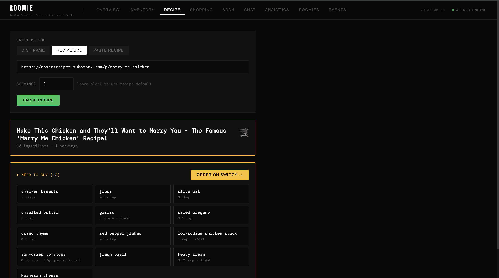

# 🏠 ROOMIE — Smart Home Kitchen Assistant

**Random Operators On My Individual Errands**

A multi-agent AI system for kitchen management, recipe parsing, and automated grocery procurement.

**Version:** Phase 4 Active  
**Status:** 🔨 In Development  
**Last Updated:** April 26, 2026

---

## What is ROOMIE?

ROOMIE is a personal kitchen OS — six AI agents that handle everything from tracking what's in your fridge to parsing an Instagram recipe and ordering the missing ingredients on Swiggy Instamart.

- **6 AI Agents** with distinct roles
- **Web Dashboard** (9 tabs)
- **Telegram Bots** for mobile access
- **Recipe-to-Cart pipeline** — URL, paste, dish name, or (soon) social media links
- **Photo scanning** for instant inventory via camera
- **Swiggy Instamart integration** — mock catalog + real OAuth ordering

---

## The Six Agents

| Agent | Role | Does |
|-------|------|------|
| **Alfred** | Orchestrator | Routes messages, coordinates agents, runs the FastAPI server |
| **Elsa** | Fridge Manager | Tracks perishables, flags low stock, processes fridge photos |
| **Remy** | Kitchen Master | Parses recipes, cross-checks fridge + pantry, hands off to Lebowski |
| **Lebowski** | Procurer | Matches ingredients to Swiggy catalog, builds carts, places orders |
| **Finn** | Strategist | Analytics, stock health scoring, AI insights |
| **Iris** | Observer | Vision model — identifies items from photos |

---

## Recipe Pipeline (Phase 4 Active)

The core flow:

```
Input (URL / paste / dish name)
  ↓
Remy scrapes + LLM extracts → structured ingredient list
  ↓
Cross-check fridge (Elsa) + pantry (Remy)
  ↓
"You're missing X ingredients — want me to order?"
  ↓
Lebowski matches catalog → builds cart → Swiggy checkout
```

**Input modes:**
- **URL** — any recipe blog (Hebbars, Archana's, Delish, Substack, etc.)
- **Paste** — copy-paste a recipe, it extracts ingredients
- **Dish name** — "Butter Chicken" → LLM generates standard recipe
- **Social media** — Phase 5 (yt-dlp + Whisper, see Roadmap)

**LLM performance:**
- Claude Haiku (recommended): **3–8 seconds**
- Ollama llama3.1:8b on M1/M2 GPU: **15–30 seconds**
- Ollama on CPU only: **60–180 seconds** — set `LLM_PROVIDER=claude`

---

## Quick Start

### Prerequisites
- Python 3.11+
- Node.js 18+
- An LLM API key — Claude Haiku is strongly recommended for recipe parsing

### Setup

```bash
# 1. Clone / navigate
cd ~/Desktop/meh/roomie

# 2. Configure environment
cp .env.example .env
# Add ANTHROPIC_API_KEY and set LLM_PROVIDER=claude
# (or OPENAI_API_KEY with LLM_PROVIDER=openai)
# (or leave as ollama — but expect slow recipe parsing)

# 3. Install Python deps
pip install -r requirements.txt --break-system-packages

# 4. Start backend + Telegram bots
bash scripts/start_dev.sh

# 5. Frontend (new terminal)
cd roomie-web
npm install
npm run dev

# 6. Open http://localhost:3001
```

### Recommended `.env` for recipe parsing

```env
LLM_PROVIDER=claude
ANTHROPIC_API_KEY=sk-ant-...

# Optional — Telegram bots
TELEGRAM_TOKEN_ALFRED=...
TELEGRAM_TOKEN_REMY=...
ALLOWED_TELEGRAM_USER_IDS=your_telegram_id

# Optional — real Swiggy orders
SWIGGY_MCP_ENABLED=false
```

---

## Web Dashboard

| Tab | What it does |
|-----|-------------|
| OVERVIEW | System health, agent status, clickable metric cards |
| INVENTORY | CRUD for fridge + pantry, search, low stock warnings |
| RECIPE | Parse recipes (URL / paste / dish name), servings scaler, Swiggy CTA |
| SHOPPING | Build + edit carts manually, place orders |
| SCAN | Upload photos → Iris detects items → inventory updated |
| CHAT | Talk to any agent in natural language |
| ANALYTICS | Stock health score, category charts, Finn's AI insights |
| ROOMIES | Agent personalities and skill registry |
| EVENTS | Full activity log |

---

## Project Structure

```
roomie/
├── agent_skills/
│   ├── alfred/          # Orchestrator, FastAPI app, LLM router
│   ├── elsa/            # Fridge inventory
│   ├── remy/
│   │   ├── main.py      # Agent handler
│   │   ├── recipe_pipeline.py  # Scrape → extract → post-process
│   │   └── prompts.py   # Slim + full extraction system prompts
│   ├── lebowski/
│   │   ├── main.py      # Procurement agent
│   │   └── mock_catalog.json   # 58 Indian + Western grocery SKUs
│   ├── finn/            # Analytics
│   └── iris/            # Vision / photo scanning
├── shared/
│   ├── db.py            # SQLAlchemy models
│   ├── llm_provider.py  # Claude / OpenAI / Ollama abstraction
│   └── models.py        # Pydantic schemas
├── interfaces/
│   └── telegram/        # One bot per agent
├── roomie-web/          # Next.js 14 dashboard
│   ├── components/      # RecipeParser, ShoppingCart, etc.
│   └── lib/alfred-client.ts
├── scripts/start_dev.sh
└── data/roomy.db        # SQLite
```

---

## Key API Endpoints

```
POST /recipes/parse          Parse recipe (direct, no router overhead)
POST /build_cart             Build Swiggy cart via Lebowski
POST /message                General agent message (with routing)
GET  /health                 System health
GET  /inventory/fridge       Fridge items
GET  /inventory/pantry       Pantry items
POST /inventory/{type}       Add item
PUT  /inventory/{type}/{id}  Update item
DELETE /inventory/{type}/{id}
```

Full reference: `API_DOCUMENTATION.md`

---

## Tech Stack

**Backend:** Python 3.11, FastAPI, SQLAlchemy, Pydantic v2, httpx  
**Frontend:** Next.js 14, React 18, TypeScript, React Query, Tailwind  
**LLMs:** Claude Haiku (default) / GPT-4o-mini / Ollama (local)  
**Integrations:** Swiggy MCP (OAuth 2.0 PKCE), Telegram Bot API  

---

## Known Limitations

| Issue | Status | Workaround |
|-------|--------|------------|
| Paste recipe slow on Ollama CPU | By design — Ollama on CPU is ~60-180s | Set `LLM_PROVIDER=claude` |
| Instagram scraping not built | Phase 5 | Paste recipe text manually |
| Mock catalog covers 58 SKUs | Partial | Items not found show as "not matched" |
| SQLite single-writer | Fine for personal use | PostgreSQL in Phase 9 |

---

## Documentation

| File | Contents |
|------|----------|
| `README.md` | This file |
| `ROADMAP.md` | All phases, scope decisions, build order |
| `ARCHITECTURE.md` | System design, agent communication |
| `API_DOCUMENTATION.md` | Full endpoint reference |
| `HARDWARE_CHECKLIST.md` | Phase 8 hardware procurement |

---

**ROOMIE** — Making kitchen management intelligent, one agent at a time. 🏠🤖

---

## 💻 Dashboard References

<div align="center">

<div class="roomie-carousel">

  <input type="radio" name="roomie-slides" id="roomie-slide-2" style="display:none;">
  <input type="radio" name="roomie-slides" id="roomie-slide-3" style="display:none;">
  <input type="radio" name="roomie-slides" id="roomie-slide-4" style="display:none;">
  <input type="radio" name="roomie-slides" id="roomie-slide-5" style="display:none;">
  <input type="radio" name="roomie-slides" id="roomie-slide-6" style="display:none;">
  <input type="radio" name="roomie-slides" id="roomie-slide-7" style="display:none;">
  <input type="radio" name="roomie-slides" id="roomie-slide-8" style="display:none;">

  <div class="roomie-slides">
    <div class="roomie-slide" id="roomie-slide-2-content">
      
    </div>
    <div class="roomie-slide" id="roomie-slide-3-content">
      
    </div>
    <div class="roomie-slide" id="roomie-slide-4-content">
      
    </div>
    <div class="roomie-slide" id="roomie-slide-5-content">
      
    </div>
    <div class="roomie-slide" id="roomie-slide-6-content">
      
    </div>
    <div class="roomie-slide" id="roomie-slide-7-content">
      
    </div>
    <div class="roomie-slide" id="roomie-slide-8-content">
      
    </div>
  </div>

</div>

</div>
